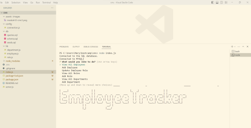
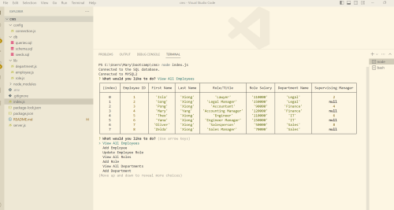

# MySQL2 Content Management Systems (CMS) Employee Tracker 

## Description

I want to build a command-line application from scratch to manage a company's employee database, using Node.js, Inquirer, and MySQL. This CMS will allow non-developers to easily view and interact with information stored in databases.

## Table of Contents

- [Installation](#installation)

- [Usage](#usage)

- [Credits](#credits)

- [License](#license)

- [Badges](#badges)

- [Questions](#questions)

## Installation

Install Node.js version 16  
Install MySQL2  
Install Inquirer  
Install dotenv  
Install ascii-art  

## Usage

  
  

Video Walk through of using CMS Employee Tracker: () 

In the command line of GitBash or Powershell, type the following to begin the CMS employee tracker: 
mysql -u root -p  
type your password  
source db/schema.sql;  
update employee information in seeds.sql file then source db/seeds.sql;  
source db/queries.sql;  
quit  
node index.js 

AS A business owner 
I WANT to be able to view and manage the departments, roles, and employees in my company 
SO THAT I can organize and plan my business 

GIVEN a command-line application that accepts user input  
WHEN I start the application  
THEN I am presented with the following options: view all departments, view all roles, view all employees, add a department, add a role, add an employee, and update an employee role  
WHEN I choose to view all departments 
THEN I am presented with a formatted table showing department names and department ids 
WHEN I choose to view all roles 
THEN I am presented with the job title, role id, the department that role belongs to, and the salary for that role 
WHEN I choose to view all employees 
THEN I am presented with a formatted table showing employee data, including employee ids, first names, last names, job titles, departments, salaries, and managers that the employees report to 
WHEN I choose to add a department 
THEN I am prompted to enter the name of the department and that department is added to the database 
WHEN I choose to add a role 
THEN I am prompted to enter the name, salary, and department for the role and that role is added to the database 
WHEN I choose to add an employee 
THEN I am prompted to enter the employee’s first name, last name, role, and manager, and that employee is added to the database 
WHEN I choose to update an employee role 
THEN I am prompted to select an employee to update and their new role and this information is updated in the database 

## Credits

Credits to Ask BCS assistance and Calendly Tutors for assisting with code contributions and/or troubleshooting errors.

## License

MIT License (https://opensource.org/licenses/MIT)

## Badges

## Questions

Contact me with questions at the following links:
GitHub Username: itsMARPON
GitHub URL: https://github.com/ItsMARPON
Email: itsmaryyang@gmail.com
